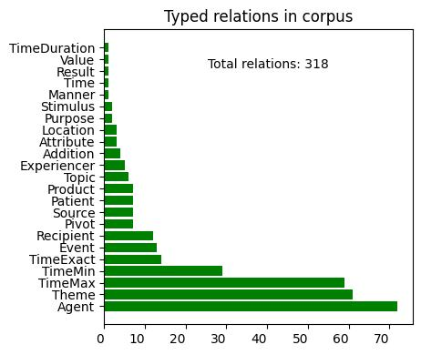
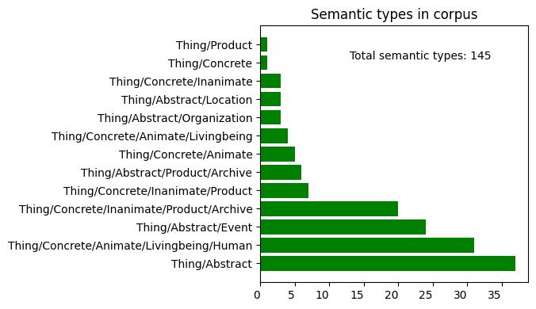

# Meaning Representation for Application Purposes (MR4AP) corpus (v0.1)

## Disclaimer

This corpus is supposed to grow in size.

## Repository contents

This repository hosts the __MR4AP__ corpus v0.1. The `files` folder contains all
the currently available JSON files. Those files present two main fields:
* `text`: the plain text that is annotated,
* `graph`: the corresponding graph containing the annotations.

Here is an example for the following sentence: `Luc a mangé une pomme`.

```json
{
    "text": "Luc a mangé une pomme.",
    "graph":
    {
        "predicates":
        [
            {
                "id": 100053566,
                "value":
                [
                    "type"
                ],
                "source": "Luc",
                "refSource": "0-0",
                "negation": false,
                "inferred": false,
                "arguments":
                [
                    {
                        "id": -1384893762,
                        "role": "Experiencer",
                        "tags":
                        [
                            "Thing/Concrete/Animate/Livingbeing/Human"
                        ],
                        "value": "Luc",
                        "refValue": "0-0"
                    },
                    {
                        "id": 100053567,
                        "role": "Attribute",
                        "tags":
                        [],
                        "value": "masculine",
                        "refValue": "0-0"
                    }
                ]
            },
            {
                "id": 100053568,
                "value":
                [
                    "type"
                ],
                "source": "Luc",
                "refSource": "0-0",
                "negation": false,
                "inferred": false,
                "arguments":
                [
                    {
                        "id": -1384893762,
                        "role": "Experiencer",
                        "tags":
                        [
                            "Thing/Concrete/Animate/Livingbeing/Human"
                        ],
                        "value": "Luc",
                        "refValue": "0-0"
                    },
                    {
                        "id": 100053569,
                        "role": "Attribute",
                        "tags":
                        [],
                        "value": "Thing/Concrete/Animate/Livingbeing/Human",
                        "refValue": "0-0"
                    }
                ]
            },
            {
                "id": -2047209676,
                "value":
                [
                    "eat-39.1-1"
                ],
                "source": "manger",
                "refSource": "0-2",
                "negation": false,
                "inferred": false,
                "arguments":
                [
                    {
                        "id": 100053570,
                        "role": "TimeMax",
                        "tags":
                        [],
                        "value": "2023-03-09T08:35:52.834852272",
                        "refValue": "0-2"
                    },
                    {
                        "id": -1384893762,
                        "role": "Agent",
                        "tags":
                        [
                            "Thing/Concrete/Animate/Livingbeing/Human"
                        ],
                        "value": "Luc",
                        "refValue": "0-0"
                    },
                    {
                        "id": 1541726646,
                        "role": "Patient",
                        "tags":
                        [
                            "Thing/Concrete"
                        ],
                        "value": "pomme",
                        "refValue": "0-4"
                    }
                ]
            },
            {
                "id": 100053571,
                "value":
                [
                    "cardinality"
                ],
                "source": "un",
                "refSource": "0-3",
                "negation": false,
                "inferred": false,
                "arguments":
                [
                    {
                        "id": 1541726646,
                        "role": "Theme",
                        "tags":
                        [
                            "Thing/Concrete"
                        ],
                        "value": "pomme",
                        "refValue": "0-4"
                    },
                    {
                        "id": 100053572,
                        "role": "Measureexact",
                        "tags":
                        [],
                        "value": "1",
                        "refValue": "0-3"
                    }
                ]
            },
            {
                "id": 100053573,
                "value":
                [
                    "type"
                ],
                "source": "pomme",
                "refSource": "0-4",
                "negation": false,
                "inferred": false,
                "arguments":
                [
                    {
                        "id": 1541726646,
                        "role": "Experiencer",
                        "tags":
                        [
                            "Thing/Concrete"
                        ],
                        "value": "pomme",
                        "refValue": "0-4"
                    },
                    {
                        "id": 100053574,
                        "role": "Attribute",
                        "tags":
                        [],
                        "value": "Thing/Concrete",
                        "refValue": "0-4"
                    }
                ]
            },
            {
                "id": 100053575,
                "value":
                [
                    "polarity"
                ],
                "source": "manger",
                "refSource": "0-2",
                "negation": false,
                "inferred": false,
                "arguments":
                [
                    {
                        "id": -2047209676,
                        "role": "Experiencer",
                        "tags":
                        [],
                        "value": "mangé",
                        "refValue": "0-2"
                    },
                    {
                        "id": 100053576,
                        "role": "Attribute",
                        "tags":
                        [],
                        "value": "Pos",
                        "refValue": "0-2"
                    }
                ]
            },
            {
                "id": 100053577,
                "value":
                [
                    "aspect"
                ],
                "source": "manger",
                "refSource": "0-2",
                "negation": false,
                "inferred": false,
                "arguments":
                [
                    {
                        "id": -2047209676,
                        "role": "Experiencer",
                        "tags":
                        [],
                        "value": "mangé",
                        "refValue": "0-2"
                    },
                    {
                        "id": 100053578,
                        "role": "Attribute",
                        "tags":
                        [],
                        "value": "performance",
                        "refValue": "0-2"
                    }
                ]
            }
        ]
    }
}
```

Each filename follows the following syntax `sentence_00000.json`.

## Corpus statistics

In this very first version, 100 short French sentences from the TaPaCo corpus 
[(Scherrer, 2020)](https://helda.helsinki.fi/bitstream/handle/10138/327739/multitatoeba_lrec2020.pdf?sequence=1)) 
are included. Below are some additional insights.

| Item   | Number |
|--------|--------|
| Sentences | 100 |
| Tokens | 534    |
| Min length | 3 |
| Max length | 12 |
| Avg length | 5.34 |

__MR4AP__'s graphs are directed graphs and are composed of nodes and relations. Each node can either be:
* an event (e.g. `eat` in _John ate an apple_),
* a state (e.g. `state` in _John is tired_),
* or a feature (e.g. `aspect`, `modality`, etc.)

Nodes can represent (named) entities. Those entities are semantically typed.

Relations link nodes to other nodes. These relations can either be:
* a thematic role (subset of VerbNet's thematic roles 
[(Schuler, 2005)](https://www.proquest.com/openview/7ca4b1b9093522a7d8089ff2e987e74e/1?pq-origsite=gscholar&cbl=18750&diss=y),
* a discursive, temporal, spatial relation tag (e.g. `Condition`, `TimeMax`, `Location`),
* or a coreference relation (`SameAs`).

Below are some additional insights.






